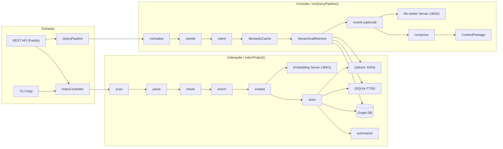
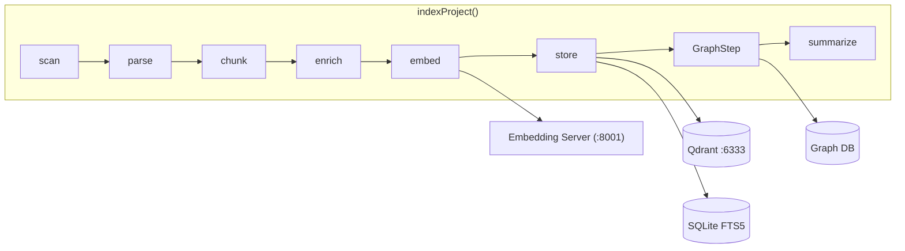
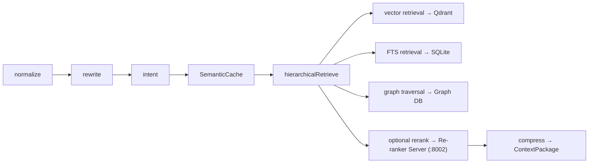

# SuperRAG — Um mecanismo RAG multimodal hierárquico local

[](https://www.typescriptlang.org/)
[](https://nodejs.org/)
[](https://www.python.org/)
[](./LICENSE)

> SuperRAG é um mecanismo de Retrieval-Augmented Generation (RAG) 100% local, hierárquico e multimodal.

Índice
- Visão geral
- Arquitetura (diagrama ASCII)
- Diferenciais
- Pré-requisitos
- Instalação
- Início rápido (5 minutos, fim a fim)
- Referência da CLI
- Referência da API REST (exemplos)
- Configuração (explicação do rag.config.json)
- Uso programático (exemplos em TypeScript)
- Arquitetura detalhada e estágios do pipeline
- Linguagens e parsers suportados
- Desenvolvimento e testes
- Solução de problemas
- Diretrizes de contribuição
- Licença

--------------------------------------------------------------------------------

Visão geral
===========

SuperRAG é um motor RAG orientado a execução local (on-premises) escrito em Node.js + TypeScript, com microserviços Python leves para cargas de trabalho de ML (embeddings e reranking). Ele combina recuperação vetorial, busca full-text (SQLite FTS5) e um pequeno grafo semântico para produzir pacotes de contexto utilizados por LLMs ou agentes.

Objetivos
- Fornecer uma stack RAG local, extensível e pronta para produção.
- Suportar multimodalidade (texto + formatos comuns de documentos) com um conjunto rico de parsers.
- Oferecer recuperação hierárquica (vetor + FTS + grafo) com reranking e compressão contextual.
- Manter dados e processamento locais por padrão; facilitar execução em diferentes hardwares (CUDA, MPS, CPU).

Quando usar o SuperRAG
- Precisa de uma camada de recuperação rápida e local para fundamentar prompts de LLM.
- Deseja indexar repositórios de código, documentos e projetos de formato misto localmente.
- Requer indexação e recuperação determinísticas e auditáveis, sem dependência de nuvem.

--------------------------------------------------------------------------------

Arquitetura
====================

Abaixo estão diagramas Mermaid que ilustram a arquitetura geral, o pipeline de indexação e o pipeline de consulta.



Detalhamento do pipeline de indexação:



Detalhamento do pipeline de consulta:



Microserviços Python
  :8001 embedding_server  (BGE-M3, /embed, /embed-batch)
  :8002 reranker_server   (BGE-reranker-v2-m3, /rerank)

Armazenamento externo
  :6333 Qdrant (vetores, 1024-dim)
  SQLite FTS5  (chunks, fingerprints, summaries, metrics)

--------------------------------------------------------------------------------

Diferenciais
=============

- Local-first e auto-hospedável: projetado para rodar totalmente em hardware local (sem lock-in com a nuvem).
- Recuperação hierárquica: combina busca vetorial, FTS e um grafo semântico leve para evidências complementares.
- Conjunto multimodal de parsers: suporte a código, marcação, formatos office e documentos binários (PDF, DOCX, XLSX).
- Montagem de contexto consciente de compressão: o contexto é rerankeado e comprimido para maximizar relevância dentro dos limites de tokens.
- Microserviços extensíveis: cargas ML rodam em processos FastAPI Python para permitir troca de modelos e dispositivos.

--------------------------------------------------------------------------------

Pré-requisitos
==============

- Node.js >= 20 (testado em Node 20+)
- npm ou yarn (os exemplos usam npm)
- TypeScript (dev dependency, já configurado no repositório)
- Python 3.10+ (para microserviços de embedding e reranker)
- Docker (recomendado para rodar Qdrant localmente) ou uma instância existente do Qdrant
- Hardware recomendado: máquina com GPU (CUDA) ou Apple Silicon (MPS). CPU-only funciona, porém é mais lento.

Hardware mínimo recomendado
- CPU: 4 cores
- Memória: 8 GB (16+ GB recomendado para datasets médios)
- Disco: SSD preferível
- GPU: opcional; se presente, serviços preferirão CUDA, depois MPS, e por fim CPU.

--------------------------------------------------------------------------------

Instalação
==========

Este trecho descreve uma instalação local completa: clone, instalar dependências JS, executar Qdrant, criar venvs Python, iniciar microserviços, compilar e executar a API.

1) Clonar o repositório

```bash
git clone https://github.com/your-org/SuperRAG.git
cd SuperRAG
```

2) Instalar dependências Node.js

```bash
npm install
```

3) Iniciar Qdrant (recomendado via Docker)

```bash
# Pull e execução do Qdrant na porta 6333
docker run -it -p 6333:6333 -v qdrant_data:/qdrant/storage qdrant/qdrant

# Container dev rápido (recursos limitados):
docker run --rm -p 6333:6333 qdrant/qdrant:v1.2.0
```

4) Microserviços Python (embeddings & reranker)

Crie um ambiente virtual e instale dependências para cada serviço. Há dois pequenos servidores FastAPI em `python/`.

Servidor de embeddings

```bash
python -m venv .venv-embed
source .venv-embed/bin/activate
pip install -r python/embedding_server/requirements.txt
cd python/embedding_server
uvicorn main:app --host 0.0.0.0 --port 8001 --reload
```

Servidor de reranker

```bash
python -m venv .venv-rerank
source .venv-rerank/bin/activate
pip install -r python/reranker_server/requirements.txt
cd python/reranker_server
uvicorn main:app --host 0.0.0.0 --port 8002 --reload
```

Notas
- O servidor de embeddings espera binários de modelos ou adaptadores locais; consulte `python/embedding_server/README.md` para seleção de dispositivo (CUDA/MPS/CPU) e configuração de modelos.
- Se executar modelos que exigem muita RAM/VRAM, verifique os requisitos do modelo.

5) Configurar ambiente e ajustes

Copie o `.env.example` e ajuste conforme necessário:

```bash
cp .env.example .env
# Edite .env para ajustar RAG_DATA_DIR, QDRANT_URL, etc.
```

Edite `rag.config.json` conforme necessário (há um padrão sensato na raiz do repositório).

6) Compilar TypeScript

```bash
npm run build
```

7) Iniciar o servidor da API (build de produção)

```bash
npm start
# ou em desenvolvimento com reload automático
npm run dev
```

Container único (Docker/Podman)
------------------------------

O repositório inclui um `Dockerfile` multi-stage e um `docker-compose.yml` que constroem uma única imagem contendo:
- Qdrant (binário copiado da imagem oficial)
- Servidor de embeddings Python (FastAPI)
- Servidor de reranker Python (FastAPI)
- API Node.js (Fastify)

Uso rápido:

1) Build da imagem

```bash
docker build -t superrag .
# ou com docker-compose
docker compose build
```

2) Subir o container apontando um repositório para indexar

```bash
REPO_PATH=/caminho/do/seu/projeto docker compose up -d
# ou
docker run -d -p 3000:3000 -v /caminho/do/seu/projeto:/workspace:ro -v superrag-data:/app/data superrag:latest
```

3) Checar saúde

```bash
curl http://localhost:3000/health
```

Notas:
- A imagem pré-baixa modelos ML no build, então o tamanho final pode ficar em ~5-6GB.
- Use `REPO_PATH` (ou monte `/workspace`) para permitir que o container indexe e fique ouvindo mudanças.
- Persistência de índices/SQLite/Qdrant é feita em `/app/data` (volume `superrag-data` no docker-compose).

Para instruções mais detalhadas, veja `docs/docker.md`.

--------------------------------------------------------------------------------

Início rápido (5 minutos, fim a fim)
=================================

Este exemplo assume que Qdrant e os microserviços Python estão em execução e que você está na raiz do repositório.

1) Compilar o projeto (ou usar `npm run dev`)

```bash
npm run build
```

2) Indexar um projeto de exemplo

```bash
# Usando o helper CLI (tsx para execução direta em TypeScript)
npm run cli -- index ./examples/sample-project --force

# Executa: scan → parse → chunk → enrich → embed → store → graph → summarize
```

3) Executar uma consulta contra o projeto indexado

```bash
npm run cli -- query "How does the auth flow work?" --path ./examples/sample-project
```

4) Consultar via REST

```bash
curl -X POST localhost:3000/query \
  -H "Content-Type: application/json" \
  -d '{"query":"How does the auth flow work?","projectPath":"./examples/sample-project"}'
```

Se tudo estiver funcionando, você receberá um JSON com um `ContextPackage` contendo documentos rerankeados e um contexto comprimido pronto para um LLM.

--------------------------------------------------------------------------------

Referência da CLI
===============

O entrypoint CLI é `rag` (implementado com `commander`). A CLI é conveniente para indexar projetos, observar mudanças, executar consultas ad-hoc e inspecionar o estado do índice.

Uso

```text
rag index <projectPath> [-f/--force] [-w/--watch] [-v/--verbose]
rag watch <projectPath>
rag query "<query>" [-p/--path] [-k/--top-k] [--json]
rag stats [--json]
rag rebuild <projectPath>
rag inspect <projectPath> [filePath] [--json]
```

Comandos
- `rag index <projectPath>`
  - Descrição: percorre o caminho do projeto e constrói/atualiza o índice. Executa o pipeline completo: scan → parse → chunk → enrich → embed → store → graph → summarize.
  - Flags:
    - `-f, --force`: força reindexação mesmo quando fingerprints batem
    - `-w, --watch`: observa o caminho e indexa incrementalmente ao detectar mudanças
    - `-v, --verbose`: mais logs
  - Exemplo: `rag index ./my-repo --force`

- `rag watch <projectPath>`: inicia um watcher persistente (chokidar) para indexação incremental.

- `rag query "<query>"`:
  - Descrição: executa o pipeline de consulta localmente e imprime uma resposta legível.

    - `-p, --path <projectPath>`: limita a recuperação a este projeto indexado
    - `-k, --top-k <n>`: define o `finalTopK` para resultados
    - `--json`: imprime JSON para máquinas
  - Exemplo: `rag query "where is the database initialized" -p ./my-repo -k 5 --json`

- `rag stats`: imprime estatísticas de armazenamento e saúde do índice (`rag stats --json`).

- `rag rebuild <projectPath>`: deleta estado derivado do projeto e reconstrói do zero.

- `rag inspect <projectPath> [filePath]`: inspeciona entradas do índice originadas de `filePath` ou do projeto inteiro.

--------------------------------------------------------------------------------

Referência da API REST
=====================

Servidor: Fastify v4 — porta padrão: 3000 (ajustável na configuração)

Todos os endpoints esperam e retornam JSON. Autenticação não é incluída por padrão — faça deploy atrás de um gateway se precisar de controle de acesso.

1) `POST /index`

- Descrição: iniciar indexação de um projeto (execução completa)
- Body: `{ projectPath: string, force?: boolean }`
- Response: `IndexingResult`

Exemplo

```bash
curl -X POST http://localhost:3000/index \
  -H "Content-Type: application/json" \
  -d '{"projectPath":"./examples/sample-project","force":true}'
```

2) `POST /refresh`

- Descrição: atualizar índice existente (por padrão `force=false`)
- Body: `{ projectPath: string }`
- Response: `IndexingResult`

3) `DELETE /index`

- Descrição: deletar dados indexados para um projeto
- Body: `{ projectPath: string }`
- Response: `{ deleted: true }`

Exemplo

```bash
curl -X DELETE http://localhost:3000/index \
  -H "Content-Type: application/json" \
  -d '{"projectPath":"./examples/sample-project"}'
```

4) `POST /query`

- Descrição: executa o pipeline de consulta. Retorna resultados rerankeados e um `ContextPackage`.
- Body:
  ```json
  {
    "query": string,
    "projectPath": string (optional),
    "topK": number (optional),
    "includeGraph": boolean (optional),
    "includeCompressed": boolean (optional),
    "filters": object (optional)
  }
  ```
- Response: `QueryResult`

Exemplo

```bash
curl -X POST http://localhost:3000/query \
  -H "Content-Type: application/json" \
  -d '{"query":"How to run tests?","projectPath":"./examples/sample-project","topK":5}'
```

5) `POST /query/agent`

- Descrição: monta um `ContextPackage` adequado para consumo por agentes. Aceita campos específicos como `maxTokens`.
- Body: mesmo que `/query` mais opções de agente
- Response: `ContextPackage`

6) `GET /health`

- Descrição: endpoint básico de saúde
- Response: `{ status: 'ok'|'error', timestamp: string, uptime: number }`

7) `GET /status`

- Descrição: retorna se há projetos indexados e o último horário de indexação
- Response: `{ indexed: boolean, lastIndexedAt?: string }`

8) `GET /stats`

- Descrição: retorna estatísticas de armazenamento para Qdrant e SQLite (contagens, tamanhos)
- Response: `StorageStats`

--------------------------------------------------------------------------------

Configuração (`rag.config.json`)
================================

SuperRAG carrega um arquivo JSON de configuração (`rag.config.json`) para controlar indexação, recuperação, embedding e armazenamento. Abaixo está o exemplo canônico e explicação de cada campo.

Exemplo

```json
{
  "dataDir": "./data",
  "logging": { "level": "info", "pretty": true },
  "embedding": {
    "serverUrl": "http://localhost:8001",
    "model": "BAAI/bge-m3",
    "batchSize": 32,
    "dimensions": 1024
  },
  "rerank": {
    "serverUrl": "http://localhost:8002",
    "model": "BAAI/bge-reranker-v2-m3",
    "topK": 20,
    "enabled": true
  },
  "qdrant": {
    "url": "http://localhost:6333",
    "collectionPrefix": "superrag",
    "vectorSize": 1024
  },
  "chunking": { "maxTokens": 512, "overlapTokens": 64, "minTokens": 20 },
  "retrieval": {
    "maxCandidates": 50,
    "vectorTopK": 20,
    "ftsTopK": 20,
    "finalTopK": 10,
    "compressionRatio": 0.6
  },
  "indexing": { "batchSize": 50, "parallelParsers": 4, "watchDebounceMs": 500 }
}
```

Explicação dos campos
- `dataDir`: diretório raiz para armazenamento persistente (DBs SQLite, sumários, artefatos).
- `logging`: configurações do pino (`pino`). `level`: trace|debug|info|warn|error; `pretty`: boolean.
- `embedding`: cliente HTTP que chama o servidor de embeddings Python.
  - `serverUrl`: URL do servidor de embeddings.
  - `model`: identificador do modelo (informativo — o servidor precisa suportá-lo).
  - `batchSize`: quantos textos embutir por requisição.
  - `dimensions`: dimensionalidade do embedding (deve bater com `qdrant.vectorSize`).
- `rerank`: configurações do servidor de reranker.
  - `serverUrl`: URL do reranker.
  - `model`: identificador do modelo (informativo).
  - `topK`: quantos candidatos pontuar (antes do pruning final).
  - `enabled`: false para pular reranking e usar apenas scores brutos.
- `qdrant`: configuração da store vetorial.
  - `url`: URL do serviço Qdrant.
  - `collectionPrefix`: prefixo usado para nomear coleções por projeto.
  - `vectorSize`: tamanho esperado do vetor (deve coincidir com `embedding.dimensions`).
- `chunking`: controles do chunker.
  - `maxTokens`: tamanho alvo do chunk em tokens.
  - `overlapTokens`: sobreposição entre chunks consecutivos.
  - `minTokens`: tokens mínimos para aceitar um chunk.
- `retrieval`: afinação da recuperação hierárquica.
  - `maxCandidates`: pool máximo de candidatos (vetor+fts+grafo).
  - `vectorTopK`: K retornado pela store vetorial por estágio.
  - `ftsTopK`: K retornado pelo SQLite FTS5 por estágio.
  - `finalTopK`: número de documentos incluídos no `ContextPackage` final.
  - `compressionRatio`: razão alvo (0–1) para comprimir o contexto ao construir payloads comprimidos.
- `indexing`: parâmetros em tempo de indexação.
  - `batchSize`: batch size para embeddings / persistência.
  - `parallelParsers`: quantos parsers rodar em paralelo.
  - `watchDebounceMs`: debounce ao observar eventos do filesystem.

Variáveis de ambiente
- `RAG_DATA_DIR` — sobrescreve `dataDir`
- `RAG_LOG_LEVEL` — sobrescreve `logging.level`
- `QDRANT_URL` — sobrescreve `qdrant.url`
- `RAG_EMBEDDING_URL` — sobrescreve `embedding.serverUrl`
- `RAG_RERANK_URL` — sobrescreve `rerank.serverUrl`

Veja `.env.example` como template rápido.

--------------------------------------------------------------------------------

Uso programático (TypeScript)
=============================

O SuperRAG é organizado em módulos TypeScript dentro de `src/`. Você pode importar módulos centrais para casos avançados (fluxos só de embedding, pipelines customizados de indexação ou inspeção de embeddings).

Exemplo: executar uma consulta indexada programaticamente

```ts
import { createServer } from './src/api/server';
import { QueryPipeline } from './src/core/query-pipeline';
import { loadConfig } from './src/config';

async function example() {
  const config = await loadConfig();
  const qp = new QueryPipeline(config);
  const result = await qp.run({ query: 'Where is the main entry?', projectPath: './examples/sample-project' });
  console.log(result.contextPackage.compressedText);
}

example().catch(err => console.error(err));
```

Exemplo: embutir um lote de textos com o cliente de embeddings

```ts
import { EmbeddingsClient } from './src/embeddings/client';
import { loadConfig } from './src/config';

async function run() {
  const cfg = await loadConfig();
  const client = new EmbeddingsClient(cfg.embedding.serverUrl);
  const texts = ['Hello world', 'How to run tests locally?'];
  const res = await client.embedBatch(texts);
  console.log('embeddings length:', res.length);
}

run();
```

Observações
- O projeto expõe construtores auxiliares (`getQdrantClient()`, `getSqliteClient()`, `getRerankerClient()`) seguindo um padrão singleton. Veja `src/utils`.

--------------------------------------------------------------------------------

Arquitetura detalhada & estágios do pipeline
===========================================

O pipeline de indexação e o pipeline de consulta são separados intencionalmente. O pipeline de indexação constrói artefatos duráveis (chunks, embeddings, entradas FTS, nós do grafo, sumários). O pipeline de consulta compõe esses artefatos no momento da requisição.

Pipeline de indexação (`indexProject`)
- `scan`: travessia do sistema de arquivos. Ignora `node_modules` e outras regras de ignore. Produz lista de arquivos e metadados (mtime, size).
- `parse`: parsing específico por arquivo usando `tree-sitter` quando aplicável e parsers especializados para formatos binários (PDF, DOCX, XLSX). Os parsers produzem texto bruto e metadados estruturais (seções, headings, blocos de código).
- `chunk`: segmentação semântica baseada em estimativa de tokens. Produz objetos `chunk` com fingerprint, caminho fonte, posições start/end.
- `enrich`: etapa opcional de enriquecimento (resumos leves, detecção de idioma, extração de headings) antes dos embeddings.
- `embed`: agrupa chunks de texto e envia ao servidor de embeddings. Embeddings armazenados junto com metadados do chunk.
- `store`: persiste metadados dos chunks e embeddings no SQLite (FTS) e Qdrant (vetores). Fingerprints evitam re-embedding de conteúdo inalterado.
- `graph`: gera arestas do grafo semântico (referências, imports, grafo de chamadas) para permitir travessia por grafo na recuperação.
- `summarize`: sumarização por arquivo e por pasta para acelerar filtros grosseiros e fornecer candidatos concisos.

Pipeline de consulta (`runQueryPipeline`)
- `normalize`: normalização básica da query (lowercase, tratamento de pontuação, heurísticas de idioma).
- `rewrite`: reescrita opcional da query para melhorar matching (expansão de aliases, sinônimos) — pluggable.
- `intent`: classificação de intenção leve para escolher estratégias de recuperação (código vs docs vs geral).
- `SemanticCache`: consulta um cache local (LRU em SQLite + fingerprints) para retornar `ContextPackage` em cache quando `query+project` batem.
- `hierarchicalRetrieve`:
  - recuperação vetorial: embedding da query → Qdrant top-K
  - recuperação FTS: SQLite FTS5 top-K
  - travessia de grafo: expandir resultados usando links do grafo semântico
  - união de candidatos: deduplicar e pontuar
- `rerank`: reranker cross-encoder opcional (serviço Python) para reavaliar candidatos
- `compress`: compressão contextual para atender ao orçamento de tokens (compressor usa heurísticas de fusão semântica e de nível de linha)
- `ContextPackage`: estrutura final que inclui `compressedText`, `documentSources` (com offsets), `nodeGraph` e metadados que um LLM ou agente pode consumir.

Armazenamento
- Qdrant: armazena vetores e metadados relacionados a vetores; usado para nearest-neighbor search.
- SQLite FTS5: armazena texto dos chunks, fingerprints e oferece busca full-text com tokenizadores adequados.
- Sumários e métricas: armazenados no SQLite juntamente com as tabelas FTS.

Reranking e embeddings
- Servidor de embeddings e reranker são microserviços HTTP pluggable. Por padrão o repositório fornece adaptadores FastAPI mínimos que chamam runners locais de modelos ou SDKs locais.

--------------------------------------------------------------------------------

Linguagens suportadas (parsers)
===============================

O SuperRAG inclui parsers para as seguintes linguagens e formatos. Cada parser extrai conteúdo textual, marcadores estruturais (funções, classes, headings) e metadados específicos quando possível.

| Categoria | Linguagens / Formatos |
|-----------|-----------------------|
| Linguagens de programação | TypeScript, JavaScript, Python, Rust, Go, Java, C, C++, C#, PHP, Ruby |
| Markup / Web | HTML, CSS, Markdown |
| Config / Dados | JSON, YAML, TOML, SQL, CSV |
| Documentos | PDF, DOCX, XLSX |
| Shell / Scripts | Bash |

Se precisar de parsers adicionais, adicione em `src/parsers` e registre no registry. Parsers usam `tree-sitter` quando disponível para extração precisa do AST.

--------------------------------------------------------------------------------

Desenvolvimento
===============

Layout do projeto (resumo)

```
src/
  adapters/
  api/
  cache/
  chunking/
  cli/
  compression/
  config/
  core/
  embeddings/
  graph/
  parsers/
  reranking/
  retrieval/
  storage/
  summarization/
  types/
  utils/
  watchers/
python/
  embedding_server/
  reranker_server/
examples/
tests/
```

Tarefas comuns de desenvolvimento
- Instalar dependências: `npm install`
- Typecheck: `npm run typecheck`
- Executar testes: `npm test`
- Rodar API (dev): `npm run dev`
- Build: `npm run build`

Testes
- Os testes usam Vitest. Rode a suíte completa com `npm test`.
- Testes unitários cobrem operações centrais do pipeline, parsers e adaptadores de armazenamento.

Diretrizes de contribuição
- Faça fork do repositório e abra um PR contra `main`.
- Garanta que novo código tenha cobertura de testes e passe pelo typecheck.
- Mantenha commits pequenos e focados. Siga o estilo de commits do repositório.
- Documente quaisquer novas opções de configuração no README e nos schemas.

Código de conduta
- Siga o código de conduta do projeto (adicione `CODE_OF_CONDUCT.md` se necessário) ao interagir com mantenedores e contribuidores.

--------------------------------------------------------------------------------

Solução de problemas
====================

Problema: Qdrant inacessível
- Sintoma: indexação falha com connection refused ou erros 502.
- Correções:
  - Verifique `QDRANT_URL` em `.env` ou `rag.config.json` apontando para sua instância Qdrant (padrão: `http://localhost:6333`).
  - Se usar Docker, confirme que o container está em execução (`docker ps`). Em VM, verifique regras de rede.

Problema: servidor de embeddings retorna erros ou falta memória
- Sintoma: erros 500 em `/embed` ou `/embed-batch`; respostas lentas.
- Correções:
  - Verifique logs em `python/embedding_server` para seleção de dispositivo; instale drivers CUDA se configurado para GPU.
  - Reduza `embedding.batchSize` em `rag.config.json` para diminuir pressão de memória.
  - Para modelos grandes localmente, garanta RAM/VRAM suficiente ou utilize modelo menor.

Problema: reranker não melhora ordenação
- Sintoma: scores do rerank são ruidosos ou sem mudança.
- Correções:
  - Verifique `rerank.enabled` em config e `rerank.serverUrl`.
  - Confirme o endpoint de saúde do reranker (`GET /health`) reportando dispositivo e status.

Problema: indexação lenta
- Sintoma: indexação completa lenta em repositórios grandes.
- Correções:
  - Aumente `parallelParsers` para usar mais CPU (se o gargalo não for I/O).
  - Use `--force` com parcimônia; fingerprints evitam re-embedding de arquivos inalterados.
  - Garanta que Qdrant esteja em SSD e não sofrendo throttling.

Problema: chunks faltando ou duplicados
- Sintoma: resultados duplicados ou chunks ausentes.
- Correções:
  - Verifique lógica de fingerprint: arquivos idênticos devem mapear para mesma fingerprint. Refaça indexação com `--force` se necessário.
  - Inspecione a tabela `chunks` no sqlite para duplicatas e metadados de origem usando `rag inspect`.

Se encontrar problemas reproduzíveis, abra uma issue com passos para reproduzir e logs relevantes (evite compartilhar segredos).

--------------------------------------------------------------------------------

Apêndice: exemplos de curl & workflows CLI
=========================================

Indexar via CLI e consultar via REST

```bash
# Indexar
npm run cli -- index ./examples/sample-project --force

# Consultar
curl -X POST http://localhost:3000/query \
  -H "Content-Type: application/json" \
  -d '{"query":"Where is the entrypoint?","projectPath":"./examples/sample-project","topK":5}'
```

Verificar saúde dos microserviços

```bash
curl http://localhost:8001/health
curl http://localhost:8002/health
```

--------------------------------------------------------------------------------

FAQ
===

Q: Posso usar um Qdrant hospedado na nuvem ou embeddings na nuvem?
A: Sim — SuperRAG é storage-agnostic. Configure `qdrant.url` para seu endpoint hospedado e aponte os servidores de embedding/rerank para serviços remotos. Lembre-se que o projeto é orientado a operação local e algumas ferramentas auxiliares assumem endpoints locais.

Q: Como adiciono um parser customizado?
A: Adicione um módulo de parser em `src/parsers` implementando a interface do parser (`parse(filePath, buffer) => { text, metadata }`). Registre no parser registry. Adicione testes em `tests/parsers` e atualize o índice de parsers.

Q: Há autenticação na API REST?
A: Não por padrão. Faça deploy atrás de um gateway autenticado (proxy, nginx, reverse proxy) ou adicione middleware em `src/api/server.ts`.

--------------------------------------------------------------------------------

Agradecimentos
===============

O SuperRAG se baseia em várias ferramentas abertas:
- Parsers `tree-sitter` para parsing de linguagens
- Qdrant para armazenamento vetorial
- SQLite FTS5 para busca full-text
- FastAPI para microserviços Python

--------------------------------------------------------------------------------

Licença
=======

Este projeto está licenciado sob a MIT License. Veja `LICENSE` para detalhes.

--------------------------------------------------------------------------------

Contato
=======

Se precisar de ajuda ou quiser contribuir, abra uma issue ou PR no repositório.

--------------------------------------------------------------------------------

Changelog
=========

Veja `docs/changelog.md` para o histórico de alterações do projeto. Se o arquivo estiver ausente, crie um PR para adicionar notas de versão.

--------------------------------------------------------------------------------

Mantenedores
===========

Mantenedores do projeto: verifique os arquivos `OWNERS` ou `MAINTAINERS` no repositório.

--------------------------------------------------------------------------------

Este README foi gerado para servir como referência completa para executar, desenvolver e estender o SuperRAG. Se encontrar áreas faltantes ou imprecisões, abra uma issue incluindo contexto e passos para reproduzir.
--------------------------------------------------------------------------------
